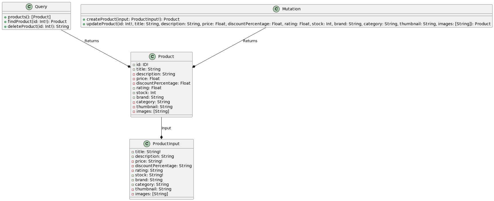
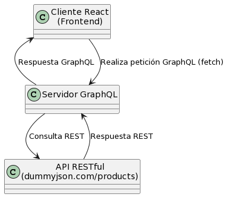

# GraphQL DummyJSON API

Este proyecto es una aplicación GraphQL que se conecta a una aplicación REST de DummyJSON para obtener datos de productos. Además, proporciona consultas (queries) y mutaciones para interactuar con estos datos y se integra con un cliente de React.

## Configuración

Para ejecutar este proyecto, asegúrate de tener Node.js instalado en tu sistema. Luego, sigue estos pasos:

1. Clona este repositorio:

   ```bash
   git clone https://github.com/Yesid-r/Taller-apolloGraphql.git
   cd Taller-apolloGraphql
2. Ejecutar backend:
    ```bash
    cd apolloGraphql
    npm install
    npm start
3. Ejecutar frontend:
    ```bash
    cd frontend
    npm install
    npm start
## Diagramas UML
### Servidor

### Interaccion cliente servidor



## Autores
#### Dairo Yesid Rincon Carreño
#### Esneider Yesid Patiño Rojas